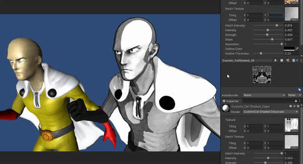
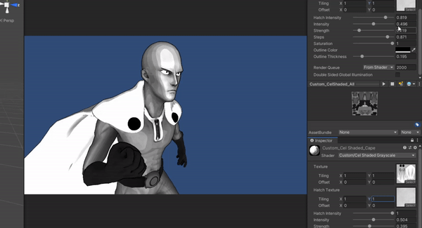

# MangaShader (or at least an attempt)

Simple cel shading with hatch textures to mimic hand drawn art in mangas. Only works with directional light.

Note: The reason this is released in (CC BY-SA 3.0)(See [LICENSE](LICENSE.md)) is because the code used for the outline shader was taken from [here](http://wiki.unity3d.com/index.php?title=Silhouette-Outlined_Diffuse&oldid=17519)(Specifically the "Outline Only Variant") which is under the same license.

No models and textures included in repository.
Model I used for testing can be found [here](https://sketchfab.com/3d-models/saitama-one-punch-man-ac98d8e938574fa0b466c1cb000a3bac).

[Research paper](http://hhoppe.com/hatching.pdf) from microsoft about real-time hatching.

